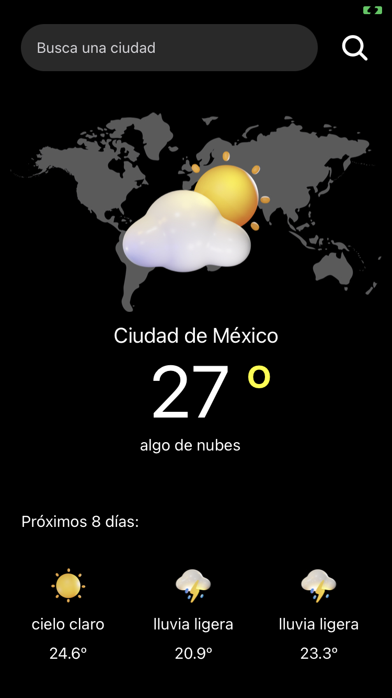

# Weather App (with Expo)




# Features 

- Search places with Reservamos API
- Show weather status with OpenWeather API

### How run 

- Add .env file with:

```javascript
REACT_APP_OPEN_WEATHER_URL
REACT_APP_OPEN_WEATHER_KEY
REACT_APP_RESERVAMOS_URL
```

- Next run `$ expo start` in proyect directory 

